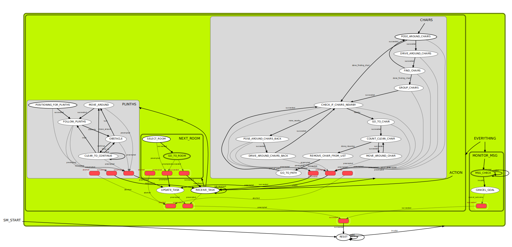
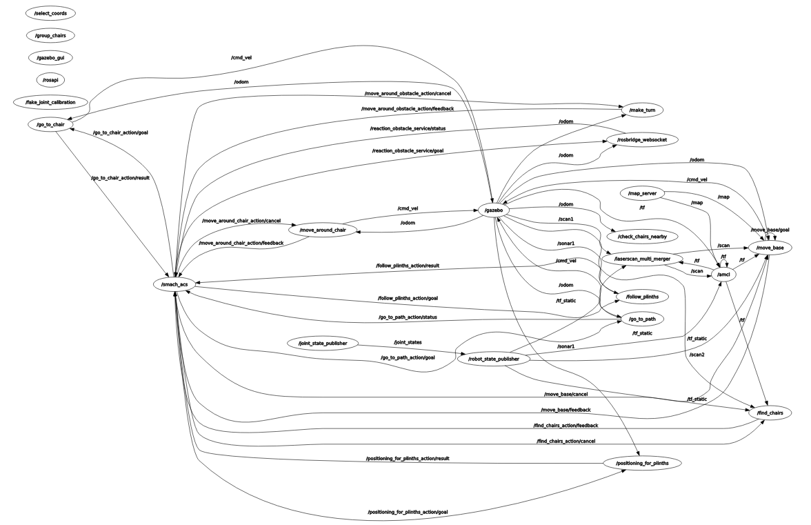

# assisted_cleaning_solution (ACS)

The robot software for the assisted cleaning solution robot. The robot can navigation from room to room, clean plinths, find deskchairs, go to deskchair and clean the deskchair.

## Dependencies

noetic:

	map_server
	move_base
	teb_local_planner
	amcl
	rosbridge_server

python3:

	pip3

pip3:	

	scipy
	numpy
	pandas

## Other needed packages

### ira_laser_tools-master

This package merges the lidars sensor data.
To use this package you need to install the ira_laser_tools-master package from source. 
The file laserscan_multi_merger.launch should look like:

	<launch>
		<arg name="node_start_delay" default="5.0" />  
		<node pkg="ira_laser_tools" name="laserscan_multi_merger" type="laserscan_multi_merger" output="screen" launch-prefix="bash -c 'sleep $(arg node_start_delay); $0 $@' ">
				<param name="destination_frame" value="base_footprint"/>
				<param name="cloud_destination_topic" value="/merged_cloud"/>
				<param name="scan_destination_topic" value="/scan"/>
				<param name="laserscan_topics" value ="/scan1 /scan2" /> <!-- LIST OF THE LASER SCAN TOPICS TO SUBSCRIBE -->
				<param name="angle_min" value="-3.14"/>
				<param name="angle_max" value="3.14"/>
				<param name="angle_increment" value="0.0064"/>
				<param name="scan_time" value="0.0333333"/>
				<param name="range_min" value="0.1"/>
				<param name="range_max" value="9.0"/>
		</node>
	</launch>

### office_test_environment

This is a RoS noetic package for a office test environment. 
To use this package you need to install the office_test_environment package from source.
More information about the package in the git repo : https://github.com/fontysrobotics/office_test_environment.git
 
This package contains:
* Configuration data of joints.
* 3D model URDF.
* Simple test launch file.

### robot_assisted_cleaning_solution

This is a RoS noetic package for the Assisted Cleaning Solution robot.
More information about the package in the git repo : https://github.com/fontysrobotics/robot_assisted_cleaning_solution.git

This package contains: 
* Configuration data of joints.
* 3D model URDF.
* launch files. For testing, Mapping and Navigation.
* Configurations for the global planner: move_base.
* Configurations for the local planner: teb_local_planner.

### gui_assisted_cleaning_solution

Repository for the web user interface of the Assisted Cleaning Solution robot.
More information about the package in the git repo : https://github.com/fontysrobotics/gui_assisted_cleaning_solution.git

This package contains: 
* The HTML files of the webpages
* The CSS files of the webpages
* The Javascript files of the webpages
* The language files
* The images used in the page

## To start the simulation, robot software and web user interface

    roslaunch assisted_cleaning_solution nodes.launch
    python3 -m http.server 7000;
    rosrun assisted_cleaning_solution smach_assisted_cleaning_solution.py

## Package information

### task message layout

	-3 = Chairs
	-2 = Plinths
	-1 = Error (does nothing yet)
    0 = Stop and Receive Task
    1 = Charging Station
    2 = Default Position in Room
    3 = Room 1
    4 = Room 2
    5 = Room 3
    6 = Room 4

The rooms can be extended with adding the coordinates in the CSV file RoomCoords so the robot can drive to the rooms. In the package gui_assisted_cleaning_solution extra room numbers should be added to the set room menu. More information about adding room numbers can be found in de readme of https://github.com/fontysrobotics/gui_assisted_cleaning_solution.git

### CSV

The CSV files are for the coordinates of the rooms and the path around the chairs. The delimiter is ';'. 
    
The RoomCoords.csv contains the coordinates of the rooms where the first column is the number the service receives. The second column is the coordinates of the rooms. The coordinate of 1000,1000,1000,1000 is to make clear that the previous coordinates should be selected.
    
The PathCoords.csv contains the coordinates of the path. In the first column the number of the steps the robot takes for the path. The second till end column contain the coordinates. The first row shows the room numbers for the coordinates below.

### SMACH

SMACH is used for the State Machine of the robot software. In the SMACH_Images in the graph folder of this package is the evolution of the State Machine visible.

### Ros node graph

The rosnode graphs can be found in the graphs/Node_Graph folder in this package.

